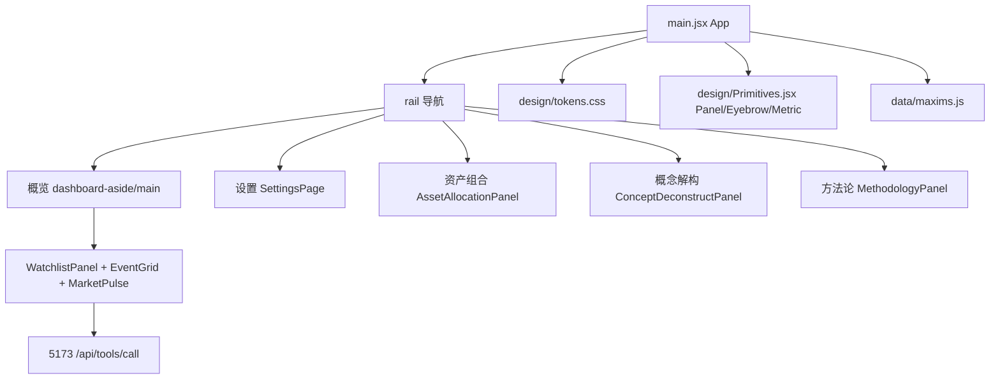

## 用户需求概述

把当前空荡的 DeepFusion 面板骨架填实、统一设计语言、重构信息展示与导航，并新增若干实用/理论模块。核心诉求是"能力来自 WebUI 与自有 skills，而非外形照搬"。

## 核心功能

1. **设计系统统一（令牌化）**：把字号、间距、留白、边框粗细、圆角、阴影等零碎样式收敛到一处（design tokens + 基础组件），所有模块统一引用，不再逐文件定位硬编码。
2. **箴言体系替代自编英文 eyebrow**：建立引经据典的箴言库（中外名句，外国句附英文），按模块语义自动匹配，替换当前尴尬的自编英文小标题。
3. **金融事件模块重做**：由"一长串纵向卡片"改为 5×4 固定展示区 + 翻页切换浏览全部卡片；卡片线条颜色语义化为 {利好:红; 利空:绿; 中性:黄; Routine类事件(对资金情绪有明确影响):浅蓝}，Routine 类覆盖美联储议息/期货交割日/公募调仓 DDL/中美重要指标发布日等。
4. **设置页重构**：Models / MCP Config 从工作台移入正式"设置"页；新增 AI 管家手动管理入口（风格 / 长期记忆 / 短期记忆 / 工作记忆，用于纠偏）。
5. **新增模块**：资产组合配置（偏实用）、概念解构（偏理论，逻辑复用"技术解构与实践落地"五层模型）、方法论/知识库（调度参考 DeepFusion 收录的 SOP/workflow 文档）。
6. **视觉下沉玻璃感**：字体像沉在玻璃/水/镜面之下，深色半透明玻璃 + 恍惚微重影（text-shadow 双影）。

## 视觉与体验要求

- 信息直观：颜色即语义，不靠读文字判断多空。
- 浏览效率：固定分页容器而非无限滚动。
- 统一调性：所有卡片/标题/间距/圆角/阴影同一套令牌，避免"每次改样式都要定位代码"。

## 技术栈

- 前端：React 18 + Vite（dashboard/src），Tauri 2 Rust 壳（src-tauri）
- 样式：单个全局 styles.css（当前已存在，需拆分为 tokens + 组件层），CSS 变量驱动
- 数据：直连 http://127.0.0.1:5173/api/tools/call（DeepFusion WebUI 后端，由 start-desktop.sh 常驻）
- 状态：React hooks（useState/useMemo/useEffect），无额外状态库

## 实现策略

1. **设计令牌化**：新建 `dashboard/src/design/tokens.css`（:root 变量：--df-font-scale、--df-space-{xs,sm,md,lg,xl}、--df-radius、--df-border-w、--df-shadow-{sm,md,lg}、--df-glass-bg、--df-glass-blur、--df-ghost-shadow 等），在 `styles.css` 顶部 `@import`。新增基础组件 `design/Primitives.jsx`：`<Panel>`、`<Eyebrow>`、`<Metric>`、`<Card>`，所有模块改用这些组件，删除散落的 `.panel`/`.eyebrow` 硬编码样式引用（保留类但改由其变量驱动）。
2. **箴言库**：新建 `dashboard/src/data/maxims.js`，导出按模块 key 匹配的箴言数组（含 source 与 en 字段）。例：持仓→"以史为镜，可以知兴替"；市场→"太阳底下无新事 / There is nothing new under the sun."；记忆纠偏→"他人即地狱 / Hell is other people."。建立 `<Eyebrow module="watchlist">` 组件自动取句，避免自编。
3. **金融事件 5×4 翻页**：在 `main.jsx` 的 DailyDashboard 事件中，把 `daily-event-list` 纵向排列改为 `EventGrid` 组件：固定 5 列×4 行=20 卡/页，分页器切换；卡片左侧线条颜色由 `sentimentColor` 扩展为四态（利好#E0584F红 / 利空#4FB38A绿 / 中性#D9B44A黄 / routine#7FB8E6浅蓝）。Routine 类在 `calendar_upcoming` 返回数据里增加 `kind:'routine'` 标记（若后端无此字段，前端按关键词"议息/交割/调仓/指标发布"正则归类兜底）。
4. **设置页**：`rail` 的"设置"项改指向 `active==='设置'`，新增 `SettingsPage.jsx`，包含：Models 配置、MCP 配置（复用现有 `mcp.js` service 与 `model-config` 接口）、AI 管家记忆管理（风格/长期/短期/工作记忆的查看与编辑入口，经 `butler` 相关接口或本地存储实现纠偏）。
5. **新模块**：

- `AssetAllocationPanel.jsx`：资产组合配置（录入仓位占比/目标配置，前端计算偏离度与再平衡建议，纯本地）。
- `ConceptDeconstructPanel.jsx`：概念解构，按五层模型（L1概念→L5性能参数）渲染可折叠树，输入概念名后调用后端检索（或本地静态知识）产出层级拆解。
- `MethodologyPanel.jsx`：方法论/知识库，列出 DeepFusion 的 SOP/workflow 文档（AGENTS.md/AGENT_BOARD.md/agents/skills/* 等）作为可检索条目，供 AI 管家分析时调度参考。

6. **视觉下沉玻璃**：背景层加深半透明（--df-glass-bg 降透明度），卡片 `backdrop-filter: blur(...)` 强化；标题/箴言加 `text-shadow: 0 1px 0 rgba(255,255,255,.04), 0 2px 8px rgba(0,0,0,.35)` 制造微重影；字体颜色降饱和、加轻微模糊感。

## 执行注意

- 不破坏既有：持仓自动备份（~/.config/deepfusion/watchlist.json）、双栏布局（dashboard-aside/main）、start-desktop.sh、5173 后端。
- 改完前端需 `npm run build`，Rust 壳需 `cargo build --release`，最后 `systemctl --user restart deepfusion-desktop.service` 加载新版。
- 后端 `calendar_upcoming` 若无 routine 标记，前端用关键词兜底，避免强依赖后端改动。

## 架构改动



## 目录结构（仅列出将新增/修改文件）

```
dashboard/src/
├── design/
│   ├── tokens.css          # [NEW] 设计令牌：字号/间距/圆角/边框/阴影/玻璃/重影
│   └── Primitives.jsx      # [NEW] Panel / Eyebrow / Metric / Card 基础组件
├── data/
│   └── maxims.js           # [NEW] 引经据典箴言库（含英文），按模块匹配
├── components/
│   ├── WatchlistPanel.jsx  # [MODIFY] 接入 Eyebrow/Primitives
│   ├── EventGrid.jsx       # [NEW] 5×4 翻页事件网格 + 四态语义色
│   ├── AssetAllocationPanel.jsx  # [NEW] 资产组合配置
│   ├── ConceptDeconstructPanel.jsx # [NEW] 概念解构五层模型
│   └── MethodologyPanel.jsx # [NEW] 方法论/知识库
├── pages/
│   └── SettingsPage.jsx    # [NEW] 设置页（Models/MCP/记忆纠偏）
├── main.jsx                # [MODIFY] 导航加"设置/资产/概念/方法论"；事件改 EventGrid；统一 Primitives
└── styles.css              # [MODIFY] 顶部 @import tokens；去硬编码，改由变量驱动；加玻璃重影
```

## 设计风格

采用"深色玻璃拟态 + 沉影"风格：内容像沉于半透明镜面/水层之下，卡片用 backdrop-filter 毛玻璃，标题与箴言带轻微双影制造恍惚感。整体克制、大气，避免花哨渐变。

## 布局

- 左侧 rail 常驻导航（图标+文字），右侧为当前页主区。
- 概览页维持双栏：左侧 sticky 常驻（任务/备注/状态），右侧滚动（持仓/市场/研究台）。
- 金融事件改为 5×4 固定网格 + 底部分页器，不再无限滚动。

## 交互

- 颜色即语义：利好红、利空绿、中性黄、Routine 浅蓝，一眼判断。
- 翻页切换事件卡，悬停卡片微亮边框。
- 箴言随模块自动出现，不喧宾夺主。

## Agent Extensions

### SubAgent

- **code-explorer**
- Purpose: 在生成详细实现前，深度盘点 DeepFusion WebUI 组件与用户自有 skills 中可复用的模块逻辑与样式范式，确保新增面板模块不重复造轮子、对齐既有约定。
- Expected outcome: 输出可复用的组件/数据获取模式清单，作为 Primitives 与新增模块的实现依据。